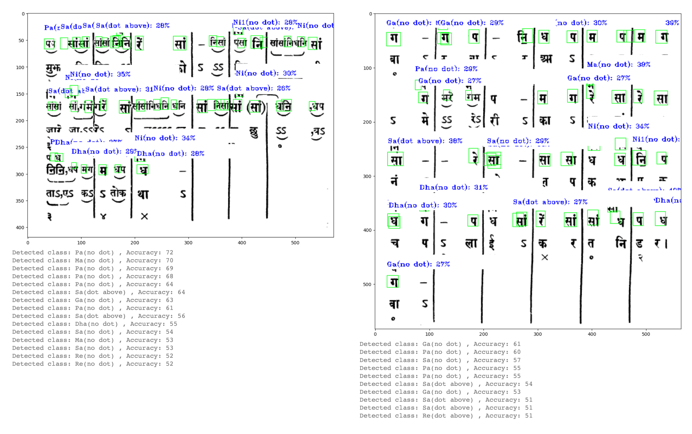

swaraDetection/
├── bhaktandePakads.ipynb  
├── images.zip 
├── label.json 
├── tensorflowCap.ipynb
├── uiandux/ 
│   ├── main.py # (Your UI application code)
│   └── ... (Other UI assets)
├── detectedSwarasPreview.pdf 
├── trainedcom.tflite 
└── README.md

# Swara Detection from Images of Old Books

This project utilizes computer vision and deep learning to detect and identify Swaras (musical notes in Indian classical music) from images extracted from old books.

## Overview

The project leverages a trained TensorFlow object detection model to locate and classify Swaras within images of musical notations. The key components include:

- **Image Dataset:** A collection of images from old books containing Swara notations, along with corresponding XML annotation files generated using LabelImg.
- **TensorFlow Object Detection Model:** A custom-trained object detection model trained to identify Swaras as objects within the images.
- **Swara Classification:** The model outputs bounding boxes around detected Swaras and assigns labels (classes) to them.
- **User Interface (UI):** A user-friendly interface built to interact with the trained model. Users can input images and view the detected Swaras highlighted with bounding boxes.

## Project Structure

- `bhaktandePakads.ipynb`:  Contains information about Swaras of a single raag and their relationships. 
- `images.zip`: Contains the image dataset used for training the object detection model, along with XML files specifying bounding box annotations for each image.
- `label.json`: Contains the list of Swara classes used for training (e.g., "Sa", "Re", "Ga", etc.).
- `tensorflowCap.ipynb`: The main training script for the TensorFlow object detection model. This generates the `trainedcom.tflite` file.
- `uiandux`:  Contains the code and assets for the user interface.
- `detectedSwarasPreview.pdf`: Contains example output images showing detected Swaras highlighted with bounding boxes.
- `trainedcom.tflite`: The TensorFlow Lite model file used for Swara detection in the user interface.

## Usage

1. **Training (if needed):**
   - If you want to retrain the model, follow the instructions in `tensorflowCap.ipynb`. 
   - You will need to install the required TensorFlow Object Detection API dependencies.

2. **Using the User Interface:**
   - Run the UI application located in the `uiandux` folder.
   - Select an image containing Swara notations.
   - The UI will display the image with bounding boxes around detected Swaras.

## Results

Example output image showing detected Swaras:

  

## Future Enhancements

- **Improved Accuracy:** Experiment with different object detection model architectures or training techniques to enhance detection accuracy.
- **Real-Time Detection:** Explore the possibility of integrating the model into a real-time application.
- **Optical Music Recognition (OMR):** Combine Swara detection with OMR techniques.
- **Integration with Musical Applications:** Develop tools or integrations to use the detected Swara information.

## Contributing

Contributions are welcome! 

## License

This project is licensed under the [MIT License](LICENSE). 
